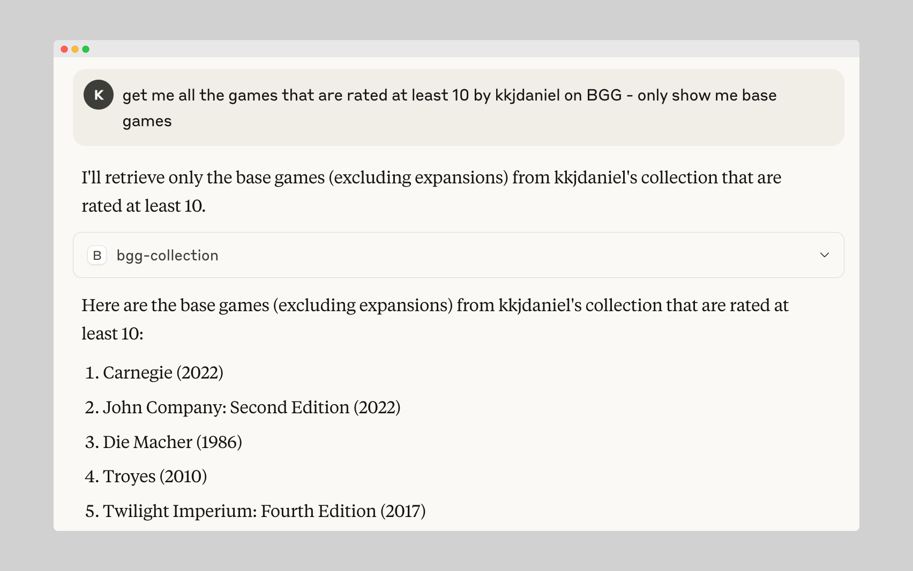

# BoardGameGeek API MCP 🎲🤖

[](https://smithery.ai/server/@kkjdaniel/bgg-mcp)

> [!WARNING]  
> This project is under active developmennt, therefore expect tooling to change.

BGG MCP is an MCP (Model Context Protocol) server that enables AI tools like Claude to interact with the BoardGameGeek API (XML API2). The server is implemented in Go, using the [GoGeek](https://github.com/kkjdaniel/gogeek) library.

## Tools

- Search _(find games by name, currently returns best match)_
- Collection _(find and filter about a users collection)_

## Roadmap

- [x] Specific Game Details _(by name)_
- [x] Collection (+ filters)
- [ ] Hot Games
- [ ] User Details
- [ ] Recommended Games

## Example



## Setup

### Installing via Smithery

To install bgg-mcp for Claude Desktop automatically via [Smithery](https://smithery.ai/server/@kkjdaniel/bgg-mcp):

```bash
npx -y @smithery/cli install @kkjdaniel/bgg-mcp --client claude
```

### 1. Install Go

You will need to have Go installed on your system to build binary. This can be easily [downloaded and setup here](https://go.dev/doc/install), or you can use the package manager that you prefer such as Brew.

### 2. Build

The project includes a Makefile to simplify building and managing the binary.

```bash
# Build the application (output goes to build/bgg-mcp)
make build

# Clean build artifacts
make clean

# Both clean and build
make all
```

Or you can simply build it directly with Go...

```bash
go build -o build/bgg-mcp
```

### 3. Add MCP Config

In the `settings.json` (VS Code / Cursor) or `claude_desktop_config.json` add the following to your list of servers, pointing it to the binary you created earlier, once you load up your AI tool you should see the tools provided by the server connected:

```json
"bgg": {
    "command": "path/to/build/bgg-mcp",
    "args": []
}
```

More details for configuring Claude can be [found here](https://modelcontextprotocol.io/quickstart/user).

## Using Makefile

The project includes a Makefile to simplify building and managing the binary.

```bash
# Build the application (output goes to build/bgg-mcp)
make build

# Clean build artifacts
make clean

# Both clean and build
make all
```
